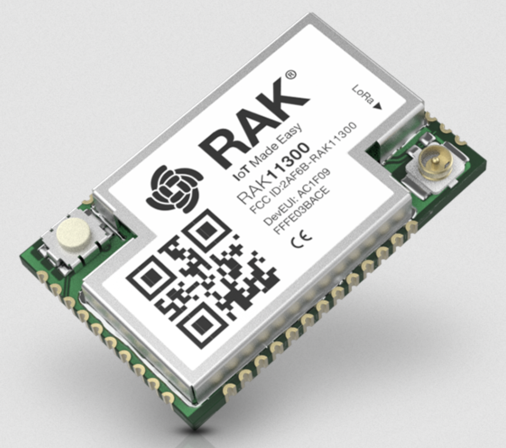

# arduino-rak
Playground for PCB's based on RAK11300, a fun little RP2040 based module combined with a SX1262 LoRa transceiver.

In this repository you can find some simple schematics to create a PCB for this module,
and some Arduino based code to get it working on TheThingsNetwork.
